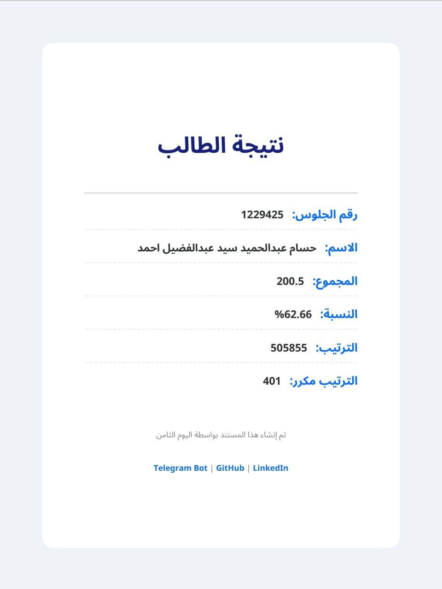
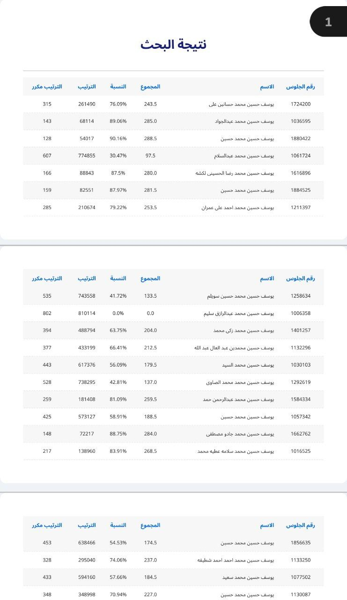

# El-Youm 8 – Telegram Bot 🤖

The **El-Youm 8 Telegram Bot** provides a simple and fast way to search Egypt's Thanaweya Amma (الثانوية العامة) results directly inside **Telegram**.  
It is part of the **El-Youm-8 System**, which also includes the **Web Application**, **RESTful API**, and **Dockerized Deployment**.

🔗 **Live Bot:** [@el_youm_8_bot](https://t.me/el_youm_8_bot)

---

## 🚀 Features

- 🔍 **Search by Name or Seat Number** directly inside Telegram.
- ✅ **Typo-Tolerant Search** (handles variations like "ه/ة" or "ا/أ").
- 📄 **PDF Generation**: Generate a downloadable PDF of the search result.
- 📊 **Detailed Results** including rank, duplicated rank, and percentage.
- 🔗 **Connected via Feign Client** to the El-Youm-8 Web App API.
- 📱 **User-Friendly Experience** designed for quick interactions.

---

## 🖼️ Bot Previews

| Action            | Preview |
|-------------------|---------|
| Start the bot     |  |
| Search by name    |  |
| single result     |  |
| multiable results |  |

---

## 🧠 Tech Stack

- **Java**: 21  
- **Framework**: Spring Boot  
- **Communication**: Feign Client (connects to Web App service)  
- **Bot API**: Telegram Bot API  
- **Containerization**: Docker & Docker Compose  
- **Build Tool**: Maven  

---

## 📂 Project Structure

```
El-Youm-8-telegram-bot/
├── src/                      # Telegram Bot source code
├── pom.xml                   # Build configuration
└── README.md                 # Documentation (this file)
```

---

## 🛠️ Setup Instructions

### 1. Clone the Repository (with submodules)
```bash
git clone https://github.com/Yusuf-Hussien/El-Youm-8-telegram-bot
cd El-Youm-8-telegram-bot
```

### 2. Configure Bot Token
Set your Telegram bot token inside `application.properties`:

```properties
bot.name=your_bot_token_here
bot.token=your_bot_user_name_here
```

### 3. Run with Maven
```bash
./mvnw spring-boot:run
```

---

## 📧 Contact

For questions or feedback, open an issue on the [GitHub Issues](https://github.com/Yusuf-Hussien/El-Youm-8/issues) page.  
Or try the bot directly: [@el_youm_8_bot](https://t.me/el_youm_8_bot)  
